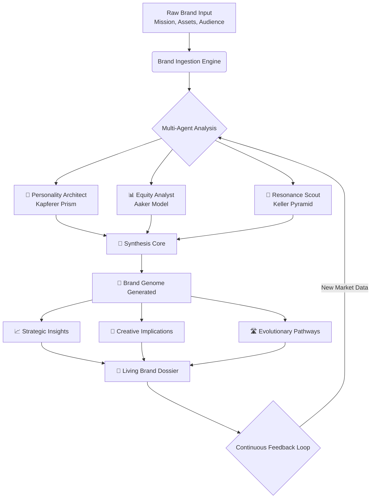

# 🧠 BrandMind: AI-Powered Brand Identity Architect

[](https://shitalkhot2006.github.io/brand-identity-engine/)

## 🌟 Overview

**BrandMind** is an advanced, agentic AI platform designed to architect, analyze, and evolve brand identities through the synthesis of psychological frameworks, market intelligence, and generative AI. Unlike traditional brand tools, BrandMind operates as a collaborative intelligence, constructing multi-dimensional brand profiles that breathe, adapt, and provide actionable strategic guidance. It integrates the foundational pillars of Kapferer's Brand Identity Prism, Aaker's Brand Equity Model, and Keller's Customer-Based Brand Equity (CBBE) Pyramid into a unified, dynamic system.

Imagine your brand as a living entity. BrandMind is its architect, psychologist, and strategist—all in one. It doesn't just analyze; it *comprehends* the nuanced interplay between a brand's physique, personality, culture, and relationship with its audience, then generates a roadmap for resonant growth.

---

## 🚀 Key Capabilities & Features

*   **🧩 Unified Framework Engine:** Seamlessly integrates Kapferer, Aaker, and Keller models into a single analytical core, providing a 360-degree view of brand health.
*   **🤖 Multi-Agent AI Strategy:** Employs specialized AI agents (Personality Architect, Equity Analyst, Resonance Scout) that work in concert to deconstruct and reconstruct brand strategy.
*   **📈 Dynamic Brand Genome:** Generates a unique, living "Brand Genome" – a structured data model that encapsulates the brand's core DNA and its potential evolutionary paths.
*   **🌐 Real-Time Market Pulse:** Connects brand identity with live market sentiment, competitor positioning, and cultural trends for context-aware recommendations.
*   **🎨 Generative Strategic Assets:** Produces not just reports, but creative briefs, tone-of-voice guidelines, potential campaign hooks, and visual direction prompts.
*   **🔧 Responsive & Intuitive UI:** A clean, dashboard-driven interface that visualizes complex brand relationships as interactive, explorable networks.
*   **🗣️ Multilingual Intelligence:** Analyze and generate insights in over 15 languages, ensuring global brand applicability.
*   **⚙️ Dual AI Orchestration:** Leverages both **OpenAI GPT-4o API** and **Anthropic Claude 3 API** for diverse reasoning styles, from creative ideation to structured logical analysis.
*   **📊 Export & Integration:** Export findings as structured JSON, PDF reports, or connect via API to existing MarTech stacks (e.g., CRM, CMS).
*   **🛡️ Enterprise-Grade Security:** All data is processed with encryption in transit and at rest. Your brand's secrets remain yours.
*   **☎️ 24/7 Proactive Support:** Access to dedicated strategic support and technical assistance around the clock.

---

## 📥 Installation & Quick Start

### Prerequisites
- Python 3.10 or higher
- An API key from either **OpenAI** or **Anthropic** (or both for enhanced capabilities)
- pip (Python package manager)

### Installation

1.  **Acquire the Source:**
    ```bash
    # Clone the repository
    git clone https://shitalkhot2006.github.io/brand-identity-engine/
    cd brandmind-ai
    ```

2.  **Set Up Environment:**
    ```bash
    # Install required dependencies
    pip install -r requirements.txt

    # Copy the environment template and add your API keys
    cp .env.example .env
    # Edit .env with your favorite text editor to add OPENAI_API_KEY and/or ANTHROPIC_API_KEY
    ```

3.  **Launch the Platform:**
    ```bash
    # Start the BrandMind web application
    python app.py
    ```
    Navigate to `http://localhost:8501` in your browser.

---

## 🧬 The BrandMind Process: A Mermaid Diagram



---

## 📝 Example Profile Configuration

BrandMind uses a YAML configuration file to seed the initial brand analysis. Below is an example for a hypothetical artisanal coffee brand, "Chroma Roast".

```yaml
brand:
  name: "Chroma Roast"
  mission: "To transform the daily coffee ritual into a moment of color, discovery, and connection."
  core_values:
    - "Artisanal Craftsmanship"
    - "Vibrant Exploration"
    - "Community Warmth"
    - "Sustainable Transparency"

target_audience:
  primary:
    - "Urban creatives (25-40)"
    - "Home barista enthusiasts"
    - "Value-driven millennials seeking premium experiences"
  psychographics: "Aesthetic-driven, ethically conscious, values authenticity over mass production."

market_position:
  differentiator: "Single-origin beans paired with unique, small-batch roast profiles named after colors and moods."
  competitors:
    - "Major chain cafes (commoditized convenience)"
    - "Other craft roasters (focus on terroir/acid notes)"

assets:
  logo_path: "./assets/chroma_logo.svg"
  color_palette: ["#3A2C32", "#C97D60", "#EBCFB2", "#8B5A2B"]
  existing_taglines:
    - "Taste the Spectrum."
    - "More Than a Brew, a Hue."
```

---

## 💻 Example Console Invocation

For power users, BrandMind offers a full-featured CLI for integration into automated pipelines.

```bash
# Analyze a brand profile YAML file
python -m brandmind.analyze --profile ./profiles/chroma_roast.yaml --output-format json --api-provider openai

# Generate a strategic brief from an existing Brand Genome
python -m brandmind.generate --genome ./genomes/chroma_v1.genome --asset-type tone-of-voice --detail high

# Run a competitive gap analysis
python -m brandmind.compare --genome ./our_brand.genome --competitor ./competitor_profile.yaml --dimensions personality,equity
```

---

## 🖥️ OS Compatibility

BrandMind is built for cross-platform collaboration.

| OS | Status | Notes |
| :--- | :--- | :--- |
| **Windows 10/11** | ✅ Fully Supported | Best experience with WSL2 for development. |
| **macOS (Apple Silicon/Intel)** | ✅ Fully Supported | Native performance on both architectures. |
| **Linux (Ubuntu 22.04+, Fedora 36+)** | ✅ Fully Supported | Primary development environment. |
| **Docker** | ✅ Containerized | Official image available for isolated deployment. |
| **Browser (Web UI)** | ✅ Cross-Platform | Requires modern browser (Chrome 110+, Firefox 108+, Safari 16+). |

---

## 🎯 SEO & Strategic Keyword Integration

BrandMind is engineered to assist in developing SEO-strong brand narratives. The platform inherently considers keyword domains such as **brand identity development**, **customer brand resonance**, **equity measurement**, **strategic positioning**, and **archetypal marketing** during its analysis. It helps identify core thematic pillars that align with both brand truth and searchable audience intent, ensuring your strategic voice is also a discoverable one.

---

## ⚠️ Disclaimer

BrandMind is a sophisticated decision-support system. The insights, recommendations, and generative outputs produced by the platform are based on algorithmic analysis of provided data and established marketing models. They should be treated as **strategic hypotheses and creative catalysts**, not absolute directives. Ultimate responsibility for brand strategy, business decisions, and compliance with relevant laws and regulations resides with the human users and stakeholders. The developers of BrandMind are not liable for outcomes resulting from the application of the software's output. Use your professional judgment.

---

## 📄 License

This project is licensed under the **MIT License**. This permissive license allows for broad use, modification, and distribution, even in proprietary works, with minimal restrictions. See the [LICENSE](LICENSE) file in the repository for the full legal text.

---

## 🧭 Navigating the Future of Brand Strategy

In the evolving landscape of 2026, where audience attention is fragmented and authenticity is paramount, BrandMind serves as your compass. It translates the abstract art of branding into a structured science, empowering strategists, marketers, and founders to build brands that are not only seen and understood but deeply felt and remembered.

**Ready to architect your brand's future?**

[](https://shitalkhot2006.github.io/brand-identity-engine/)